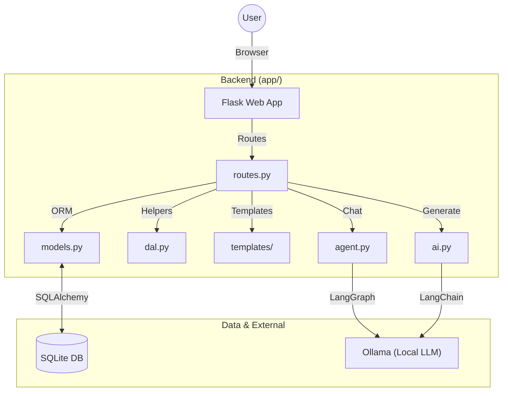

# Trip Planner

This is a Flask-based web application for planning trips. It allows users to create and manage detailed travel itineraries, with optional AI-powered features for generating and refining plans.

## Functional Explanation

The application provides a comprehensive solution for trip planning:

- **Trip Management**: Create, update, and delete trips, each with a name, description, and date range.
- **Daily Itinerary**: Each trip is broken down into individual days. For each day, you can specify hotel details, travel distances, and a list of activities.
- **Activity Planning**: Add multiple activities to any day, including details like location, price, and reservation information.
- **General Items**: Keep track of non-daily items like flights, car rentals, or travel insurance.
- **AI Itinerary Generation**: Automatically generate a complete, detailed itinerary for a trip based on its name and dates. The AI suggests hotels, activities, and travel details.
- **Interactive AI Agent**: Chat with an AI agent to get suggestions for hotels or activities for a specific day.
- **Export Options**: Export trip itineraries to PDF or CSV format for offline use, printing, or importing into spreadsheet applications.
- **Google Maps Integration**: Automatically enriches locations with Google Maps links for easy navigation.

### ⚡️ Streaming AI Generation ("Generate Proposal")
- **Real-time Reasoning**: The AI "thinks" out loud, showing its reasoning process in a streaming console before producing the final JSON.
- **Interactive Proposal**: The "Generate Proposal" button creates a draft. You review the JSON output and, if satisfied, click "Apply" to save it to your trip.
- **LangChain & Server-Sent Events**: Uses modern streaming standards to provide a responsive user experience without long loading times.

## Privacy & Local-First

**Your Data Stays With You.**

This application is designed to be run entirely on your local machine.

- **Offline Capable**: The core application, including the database and AI features, functions without an internet connection (Google Maps links obviously require internet).
- **No Data Sharing**: Your travel plans, personal notes, and preferences are stored locally in a SQLite database (`instance/trips.db`). Nothing is sent to the cloud.
- **Local AI**: The AI features use [Ollama](https://ollama.com/) to run Large Language Models directly on your hardware. Your prompts and the AI's responses never leave your computer.

## Architecture

The system follows a standard MVC-like pattern with Flask. It integrates with a local LLM via Ollama for AI features.



## How to Execute the Code

1.  **Install Dependencies**:
    Ensure Python 3 is installed. Install packages from `requirements.txt`:
    ```bash
    pip install -r requirements.txt
    ```

2.  **Set up AI Model (Optional)**:
    This project uses [Ollama](https://ollama.com/) for local AI.
    - Install Ollama.
    - Pull the default model:
      ```bash
      ollama pull gemma2:9b
      ```

3.  **Run the Application**:
    Start the Flask development server:
    ```bash
    python run.py
    ```
    The app will be available at `http://127.0.0.1:5000`.

## Configuration

The application can be configured using environment variables.

| Variable | Default | Description |
| :--- | :--- | :--- |
| `DATABASE_URL` | `sqlite:///instance/trip_planner.db` | Connection string for the database (SQLAlchemy format). |
| `SECRET_KEY` | `dev-secret-key` | Secret key for Flask session security. Change this in production. |
| `OLLAMA_MODEL` | `gemma2:9b` | The Ollama model for AI features. **Recommended models**: `qwen2.5:14b` (best quality, requires 16GB+ RAM), `gemma2:9b` (balanced, good default), `llama3.1:8b` (fastest). |

## Code Structure

```text
/
├── .gitignore             # Git ignore rules
├── LICENSE                # Project license
├── README.md              # Project documentation
├── requirements.txt       # Python dependencies
├── run.py                 # Application entry point
├── app/                   # Main application package
│   ├── __init__.py        # App factory
│   ├── dal.py             # Data Access Layer helpers
│   ├── database.py        # Database connection setup
│   ├── models.py          # SQLAlchemy database models
│   ├── routes.py          # Flask routes & controllers
│   ├── services/          # AI Service logic
│   │   ├── agent.py       # Interactive AI agent (LangGraph)
│   │   └── ai.py          # Itinerary generator (LangChain)
│   ├── templates/         # Jinja2 HTML templates
│   └── utils/             # Utility modules
│       ├── csv_export.py  # CSV export generation
│       ├── pdf_export.py  # PDF export generation
│       └── maps.py        # Google Maps link enrichment
├── instance/              # Instance-specific data (SQLite db)
└── logs/                  # Logs for AI interactions
```

## Database Schema

The database uses SQLite by default with SQLAlchemy ORM.

- **`Trip`**: The root entity.
    - Has `name`, `description`, `start_date`, `end_date`.
    - Relationships: `days` (One-to-Many), `general_items` (One-to-Many).
- **`Day`**: Represents a single day in a trip.
    - Has detailed hotel info (`hotel_name`, `hotel_location`, `hotel_price`, etc.) and travel info (`distance_km`).
    - Relationships: `trip` (Many-to-One), `activities` (One-to-Many).
- **`Activity`**: A specific activity within a day.
    - Has `name`, `description`, `location`, `price`, `reservation_id`.
    - Relationships: `day` (Many-to-One).
- **`GeneralItem`**: Non-daily items (e.g., flights, insurance).
    - Has `name`, `description`, `price`, `reservation_id`.
    - Relationships: `trip` (Many-to-One).

## Special Instruction for AI Agents

If you are an AI assistant (Claude, Cursor, etc.) working on this project, please refer to [AGENTS.md](./AGENTS.md) for critical technical context, coding guidelines, and the strict offline-first privacy policy.